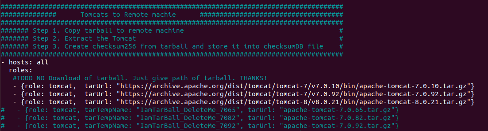
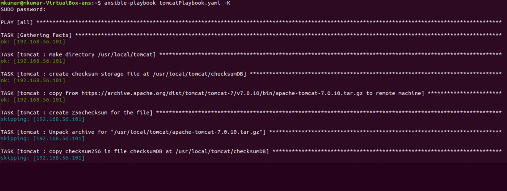

# tomcatProvisioning
Tomcats from Apache website to virtual machines defined in the host-inventory file using ansible.

----

Apache allows APIs to download Tomcats, so we don't have to manually download Tomcats by accepting the license to the local drive at control host(where ansible is installed).

[Location of all Tomcats-5](https://archive.apache.org/dist/tomcat/tomcat-5/), [Location of all Tomcats-6](https://archive.apache.org/dist/tomcat/tomcat-6/), [Location of all Tomcats-7](https://archive.apache.org/dist/tomcat/tomcat-7/), [Location of all Tomcats-8](https://archive.apache.org/dist/tomcat/tomcat-8/), and [Location of all Tomcats-9](https://archive.apache.org/dist/tomcat/tomcat-9/)
 

>- Source(control machine) and Destination location(controlled machines) of Tomcats should be defined in variables file at **_/group_vars/all.yaml_**
>- Ansible module copies the Tomcats tarball from control to controlled machine, make a sha256 for tarball in file named as checksumDB at **_/Tomcat_Destination/checksumDB_** 
>- We are not deleting the tarball to make ansible not copy the same tomcat tarball again.

<br/>

* [tomcat] = host name for deploying Tomcat's to IPs given in hosts inventory file.
* tarURL = name of the tarball downloaded from the web.


* role: tomcat = role name for playing included tomcat playbook **_/roles/tomcat/tasks/main.yml_**


* hosts: [tomcat] = hosts name where tasks needs to be performed via playbook **_/etc/ansible/hosts_**


### The overall structure looks like


and


```
file: tomcatPlaybook.yaml
Directories:
  * roles
  * group_vars
```

# How to run playbook

```
ansible-playbook tomcatPlaybook.yaml -K
```
Where
```-k``` = ask for privilege escalation password.




This is what resulted at Controlled machine(destination machine, where provisioning is done).


checksumDB file at Controlled machine(destination machine, where provisioning is done).
 
